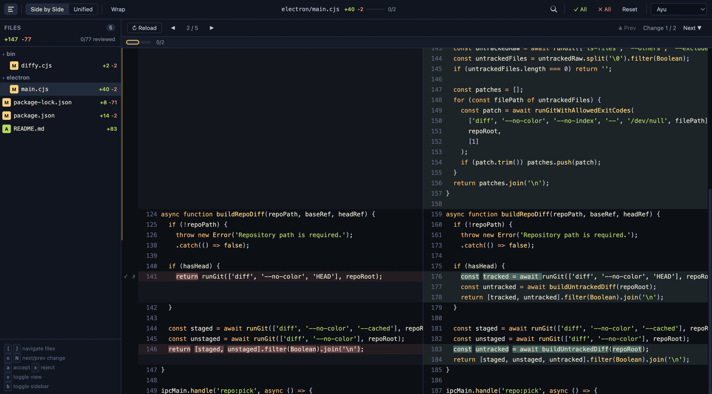

# Diffy

Terminal-first desktop Git diff viewer.

Open from any repo with one command and review changes in a side-by-side UI.

## Screenshot




### Run without install

```bash
npx github:royal-git/diffy --help
```

## Highlights

- Side-by-side and unified diff views
- Word wrap toggle
- Search + next/previous match navigation
- Chunk-level accept/reject tracking
- Theme presets (persisted)
- Git ref and PR compare modes from terminal

## Requirements

- macOS
- `git`
- Node.js + npm
- Optional: GitHub CLI `gh` (only for `diffy --pr <number>`)

## Install From GitHub

### Global install (recommended)

```bash
npm i -g github:royal-git/diffy
diffy --help
```


### Dev mode (clone + link)

```bash
git clone https://github.com/royal-git/diffy.git
cd diffy
npm install
npm link
diffy --help
```

## Quick Start

Run inside any Git repository:

```bash
diffy
```

## CLI Usage

Show local changes (tracked + untracked):

```bash
diffy
```

Compare current branch commits against a ref:

```bash
diffy -b origin/master
```

Explicit base/head compare:

```bash
diffy --base origin/main --head origin/feature/my-branch
```

Open a PR diff in the current project:

```bash
diffy --pr 123
```

## Behavior Notes

- `diffy` includes untracked files.
